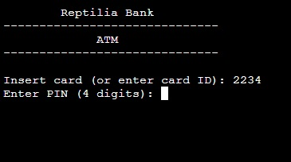
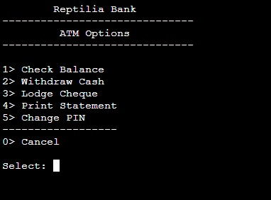
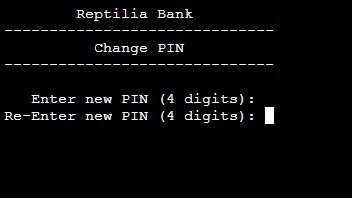

# Repilia ATM 
## Index
* [Live site](#live-site)
* [Reptilia ATM](#reptilia-atm)
* [Program Features](#program-features)
* [Google Sheets](#google-sheets)
* [Flowchart](#flowchart)
* [Functional Testing](#functional-testing)
* [Bugs](#bugs)
* [Technologies used and Deployment](#technologies-used-and-deployment)
* [Credits and APIs](#credits-and-apis)

## Live Site
https://reptilia-05304502b20b.herokuapp.com/  

([Back to top](#index))  

## Reptilia ATM
Reptilia ATM is and ATM simulator.  
It provides a set of features typical on a high-street bank ATM...  
1. Check Balance  
2. Withdraw Cash  
3. Lodge Cheque  
4. Print Statement  
5. Change PIN  

### Cash and Cheque accounts
There are 2 'Bank' Accounts in the ATM.  
9999 - Cash account - This is the 'Cash' in the ATM and decreases.  
9998 - Cheque account - This is the total Cheques (Lodgements) in the machine and incremenets when the lodgement action is performed.  
Both of these are show in the Accounts screen grab under 'Google Sheets' below.  

### Future Features...
1. ATM activity logging is in the code already and could be enhanced and implemented in a future release for auditing or troubleshooting by the bank.  
2. While this only a simulation, it would be possible to add card reader and printer to bring it closer to a full ATM.
3. Cash Cassette topup - Add Cash to the machine when the Security truck inserts a fresh cash cassette.
4. Lodge Cheques - Technically Cheques should not go direct to account unless honoured by a bank. This could be added as a stage so Cheque Lodgement does not immediately increment account balance.

  
([Back to top](#index))  

## Program features
### Attract screen

This is typical of any ATM, machine is waiting for a card.  
This is a simulator and we do not have cards, so the attract screen waits for a valid card number to be entered.  
Once this is entered, the card is authenticated with PIN.  
Validation is in place checking that the input card number and PIN are numeric and the correct length.  

The machine has 2 internal counters or accounts.  
The first is the Cash account which keeps check of the cash remaining in the machine. If this runs out then the machine can no longer dispense cash.  
The second account if for Cheque Lodgements. This account keeps track of any funds entered and adds this to the users account balance.  

### Menu/Navigation

The Menu sits at the core of the program.
From here the user chooses a function.

### Balance

The user can view their balance on this screen.
The Balance is displayed for a few seconds, then returns to the Menu.

### Withdraw Cash

The user can 'withdraw cash' here.  
Validation checks and notifications...
1. Advises available funds in account.
2. Checks for adequate funds in their account.
3. Check for adequate cash in the ATM
4. Check for Numeric input and keyed amount is a multiple of 10
5. Checks for non-numeric input as this will run on a PC.
6. Withdrawal limit is set as a system variable

### Lodge Cheque

The user can 'lodge cheques' here.  
Validation checks and notifications...
1. Lodgement limit is set as a system variable.
2. Check for Numeric input - keyed amount can have decimal places.
3. Checks for non-numeric input as this will run on a PC.

### Print Statement

The user can 'Print a statement' here.  
1. Displays a list of transactions for the account and shows the balance on the account. 
2. Shows Date of transaction and the value lodged or withdrawn form the account.
3. Where there are too many transactions to be displayed, asks user to press <Enter> to see more transactions, page count is tracked in the page header.

### Change PIN

The user can change the PIN on their card here.  
1. Validation of Numeric input
2. Check that 4 digits entered, advising the number of digits keyed if incorrect
3. PIN verification - If both PINs match, PIN is updated for the card and advised as such.

  
([Back to top](#index))  

## Google Sheets
  
Google Sheets is used to maintain Card data, Accounts, Transactions, and ATM_logs.  

* **gspread**: For access to Google Sheets.

### Card data...
  
* **number**:
The ID or number for the card  - Unique identified for each 'card'
* **pin**:  
The ID or number for the card  - User changeable
* **pin_fail**:  
The count of failed pin attempts for the card  - Increments to maximum of 3, then card will no longer work without Bank/admin intervention (set this field to 0)  
* **account**:  
The bank account associated with the card  - Cards are tied to a bank account.  

### Accounts...
  
* **number**: Account number
* **name**: Name on the card
* **address**: Address for account holder
* **branch**: Branch for the account
* **balance**: Balance on the account
* **data**: Date of last transaction on the account, therefore, the date of the balance
* **status**: Account status, currently unused but could be used for future revisions for placing accounts on hold or closing accounts.

### Transactions...
  
* **date**: Transaction date
* **account**: Account on which the transaction took place
* **transaction**: Transaction type
* **value**: Value of the transaction
* **medium**: Medium for the transaction, for this project, it is assumed Cash withdrawals and Cheque lodgements 
* **new_balance**: Account balance at the end of the transaction. This is typically the same value as written to the Account.

### ATM log...
  
* **date**: The date of the action
* **action**: The action type
* **data**: Data pertinent to the transaction

([Back to top](#index))  

## Flowchart
This flowchart shows the core function of the program.  
  
  
([Back to top](#index))  

## Functional Testing

Testing was performed to ensure all features on the respective pages work as designed.

Menu testing  was done by selecting the appropriate option.

| Menu Option        |  
| ------------------ |  
| 1. Balance         |  
| 2. Withdraw Cash   |  
| 3. Lodge Cheque    |  
| 4. Print Statement |  
| 5. Change PIN      |  
| 0. Exit            |  

### Card and PIN testing
Steps to test:
1. Open application in Heroku site at head of this document.
2. Key in card number and PIN
3. Control progresses to Menu

Expected:  
If card is non numeric, error is flagged and control comes back to input.  
If card is not 4 digits, error is flagged and control comes back to input.  
If card number is invalid, error is flagged and control comes back to input.  
If card number is coreect, control passes to PIN input abd validation.

If PIN is non-numeric, error is flagged and control comes back to input.  
If PIN is not 4 digits, error is flagged and control comes back to input.  
If PIN failed count is 3, user is notified to contact bank.  
If PIN fail reaches 3, user is notified that card is retained.  
If PIN fails but lower than 3, user is notified of remaining attempts.  
If PIN is successful, pin fail count is reset to 0, and control moves to Menu.  

Actual:  
All behavior is as expected  

### Balance  
1. Select Balance option in Menu.  
2. Balance is displayed on screen for a number of seconds.  
3. Control returns to Menu  

Expected:  
Balance is displayed for a few seconds.  

Actual:  
All behavior is as expected  

### Withdraw cash  

1. Select Withdrawal option in Menu  
2. Key in desired amount, multiples of 10.  
3. Validate input amount.  
4. If Funds are available withdraw the requested amount, decrease account balance and amount of cash remaining in machine.  

Expected:
Entered amount is checked for multiple of 10 using DivMod. amount not ending in 0 is rejected.
Account balance is checked. If funds are not available, machine reports 'insufficient funds'
Machine Cash balance is checked for available cash, If cash is not available, machine reports 'insufficient cash in ATM'

Actual:  
All behavior is as expected  

### Lodge Cheque  

1. Select Lodgement option in Menu  
2. Key in desired amount, any amount up to Lodgement limit  
3. Machine validates input amount.  
4. Funds are added to account balance and internal amount in machine.

Expected:
Entered amount is checked for numeric, any amount up to the Lodgement limit.  
Machine cheque balance is incremented byt he input amount.  

Actual:  
All behavior is as expected  

### Change PIN   

1. Select Change PIN option in Menu.  
2. Key in required new PIN. 4 digits.  
3. Key in verification PIN. 4 Digits.  
4. If both PINs match, PIN is updated on card.  

Expected:
For Initial and confirmation PIN...
If PIN is non-numeric, error is flagged and control returns to Menu.  
If PIN is not 4 digits, error is flagged and control returns to Menu.    
PIN is not set on any error and change may be reattempted.  

Actual:  
All behavior is as expected  

### Statement  

1. Select Statement option in Menu  
2. Up to 10 transactions can be displayed on screen.  
2. If more than 10 transactions, user presses -Enter- to go to next page.
3. Balance is shown at the bottom of the last screen.
4. -Enter- returns control to Menu.

Expected:
Statement prints which has correct and logical transactions, easily viewable.

Actual:  
All behavior is as expected  

## Machine Parameters
The machine has a number of parameters by way of constants which are set on program.
* **Bank name**: BANK_NAME = "Reptilia Bank"
* **Currency**: CURRENCY = "EUR"
* **Max failed PIN on card**: MAX_PIN_FAIL = 3
* **Set display width**: DISPLAY_WIDTH = 30
* **Bank Account (Account for the ATM machine)**: CASH_AC = "9999"
* **Bank Account (Account for the ATM machine)**: CHEQUE_AC = "9998"
* **Withdrawal limit**: WITHDRAWAL_LIMIT = 300
* **Lodgement limit**: LODGEMENT_LIMIT = 1000

## Test devices  
Program was also tested on...  
- Google Pixel 4  
- Dell Latitude Laptop  

## Bugs  
Most bugs were from syntax errors along the way, and from trial/error as I learned the language on the way.  
Generally, once I found how a coding feature worked and tested, I figured out how to implement it.  

When validating code, I found that pylint was sensitive about 'return' in an if-then-elif-else conditional. While the code worked OK, pylint was not happy. To workaround this I  simplified any affected code and found that using a 'while' loop with 'break' achieved the same thing but with no pylint reports.  
### Pylint final report...  

 
Not a bug, but read/write from Google sheets is not the quickest, so introduces small delays at times, unfortunately, outside my control.  

Type-ahead is possible into keyboard buffer, but not advised. It is best to wait for the outcome of any input first and any subsequent prompt.  

([Back to top](#index))

## Technologies used and Deployment  
The code is written in Python.  
Program code sits in this Github repository.  
Data sits in a Google sheet and is accessible via Google auth.
The development IDE used is Gitpod.  
Code commits are pushed to Github as the code develops with brief relevant comments.  
Validation was done with PyLint on GitPod.  

## Frameworks, Libraries and Programs

* **gspread**: For access to Google Sheets.
* **Google OAuth2**: For authentication and authorization for Google APIs.
* **datetime**: To manage date and time data.
* **json**: For handling JSON data.
* **LucidChart**: Flowchart tool.
* **GitPod**: Integrated development environment (IDE) used for project.

### Deployment
Set up an account on http://www.heroku.com Go to Heroku.com and follow the process.  

Once registered, sign in to Heroku and click "New" > "Create new app".  
Choose an app name and appropriate region and click "Create app".  

Navigate to "Settings" click "Reveal Config Vars".  
Add the following config KEY/VALUE combinations:  
CREDS/--contents of creds.json file--  
PORT/8000  

Navigate to Buildpacks and add buildpacks for Python and NodeJS (in that order).  
Navigate to "Deploy". Set the deployment method to Github and enter repository name and connect.  
Scroll down to Manual Deploy, select "main" branch and click "Deploy Branch".  

The app will now be deployed to Heroku  

([Back to top](#index))  

## Credits and APIs  
os - This is used to clear the display when repainting the screen.  
time - Used for sleep feature to pause display for a period.  
getpass - This is used to hide PIN inputs.  
gspread - Enables manipulation of Google Sheets to store all transactional data.  
datetime - To generate timestamps on transactions and activities.  
google.oauth2.service_account - To import Google credentials for access to gspread(Google Sheets)  
W3C tutorials were referenced for sample python functions for this project.
  
([Back to top](#index))  